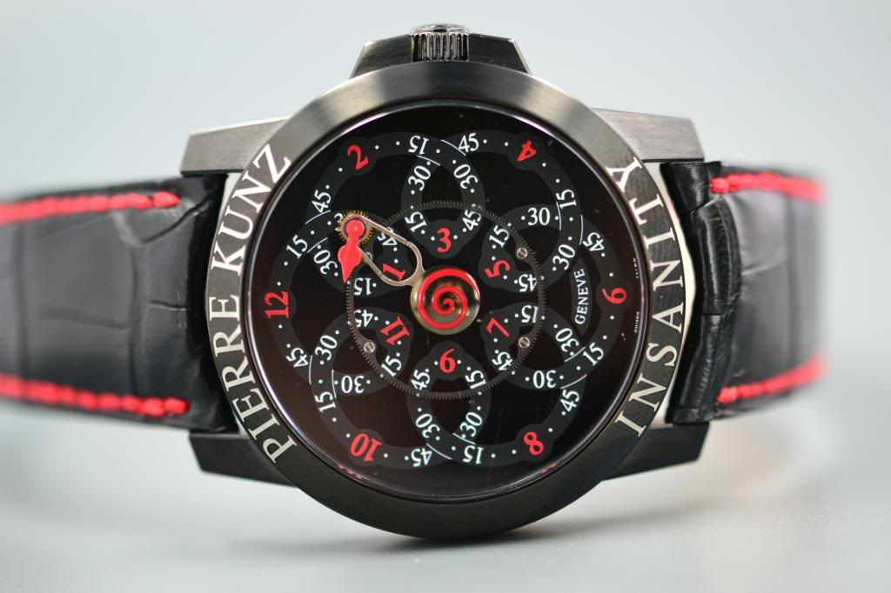
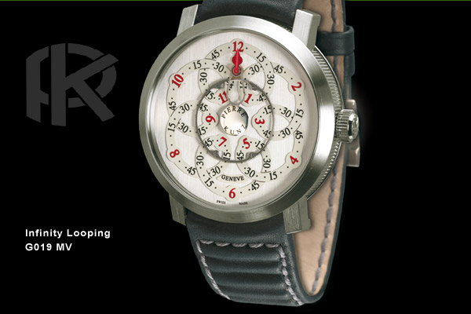

# Dementia project
An epitrochoid watch.

<small>(click to see the animated version)</small>

## Components
Let's define:

* `θ` as the current radian angle on a 12-hour clock (at 6, θ=π; at 3, θ=π/2)
* `n` as the number of rotations from the secondary gear on one revolution over the main gear (related to the gears ratio)

### Primary gear wheel
Static with regard to the watch,

* Radius (mid-teeth): `R`
* Number of teeths: `T`

### Secondary gear wheel
Rotates over the primary cogwheel,
At θ = 0, the cogs must align with the main gear wheel.

* Radius (mid-teeth): `r` (radius has to be `R/n`)
* Number of teeths: `t` (`t` has to be `T/n`)

Position:

* X coordinate: `(R + r) * cos(θ)`
* Y coordinate: `(R + r) * sin(θ)`
* Rotation: `n * θ` (modulus 2π)

### Hour hand
Static with regard to the secondary gear wheel,
At θ = 0, must point up.

Distance from secondary wheel center: `d` (ideally, `d > r`)

### Transmitter
The hand extending from the center of the watch to the secondary wheel.

Position:

* Rotation: `θ`

### Ribbon
An [epitrochoid](https://en.wikipedia.org/wiki/Epitrochoid) of parameters `(R, r, d)`.

> To get started, we'll use the following values:
> 
> * `n=6`
> * `R=240`
> * `r=40`
> * `T=150`
> * `t=30`
> * `d=25`

## Inspiration / Credits
When I was younger, I saw this watch from "haut horloger" Pierre Kunz.

The watch was named *Infinity looping*, or sometimes *Insanity*. 

Concept is relatively simple; basically a spirograph. Two meshing gears, with an hour hand on the smallest of them, over an epitrochoid ribbon with regular markings.

The watch is gorgeous, and if you can afford to spend between $8k-$20k, I'd definitely recommend it. I personally can't.

But I do own an Android Smartwatch!
And it comes with the ability to use a custom "Watch face" to display passing time. I decided to build on Insanity's concept, and come up with my own unique take on it---since it's displayed on screen, it's easy to change some of the inner machinery or add more information to the watch.
